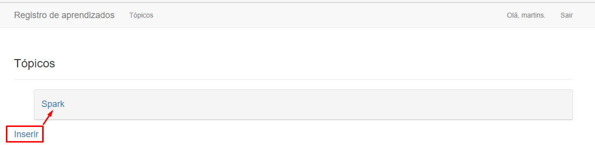
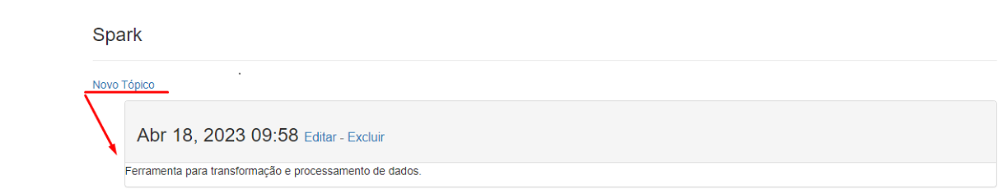
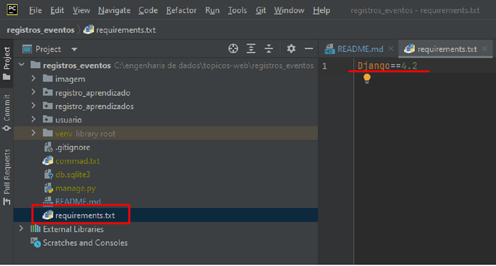
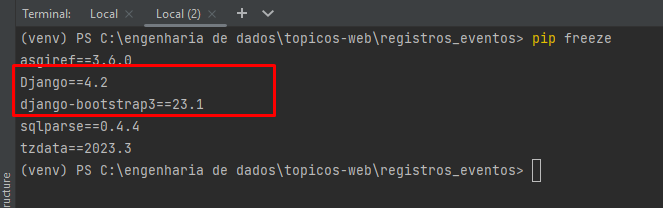

# Registros de eventos

<h4>A aplicação web permite criar anotações por tópicos.</h4>

 

 

 

<h4>Requisitos de instalação</h4>

* python -m pip install --upgrade pip
* pip install django-bootstrap3
* Instalação do Django está dentro de requirements.txt.
  * 
* O projeto ao final deverá ter todas as dependências listadas para seu funcionamento.
  * 

